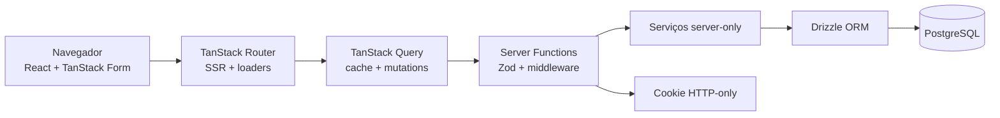
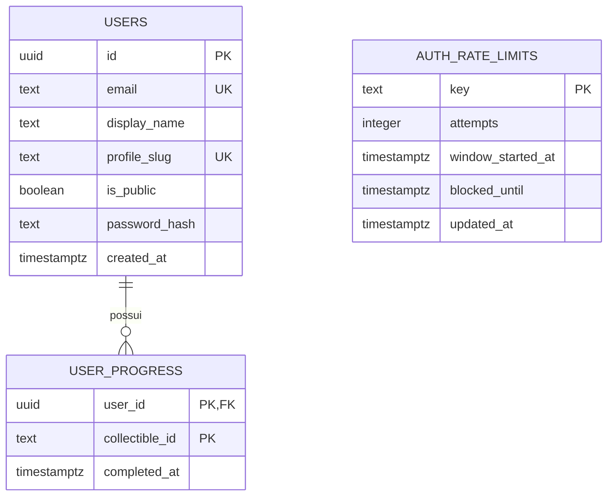
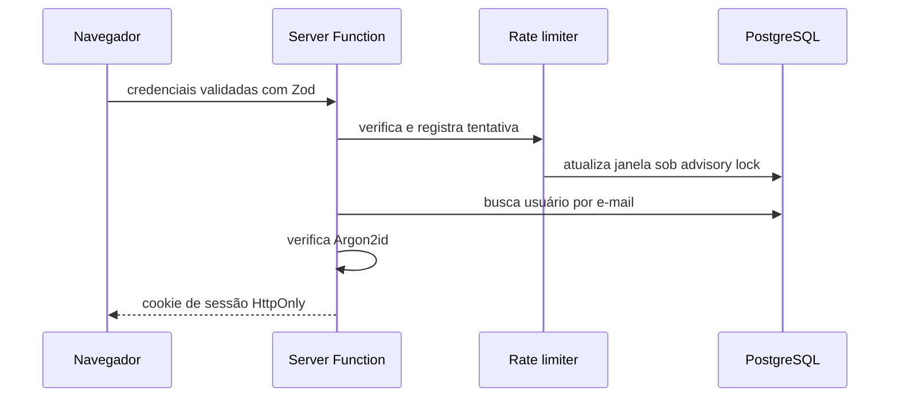

# Arquitetura

## Visão geral

O checklist continua sendo o produto. A stack existe para demonstrar fronteiras reais de uma
aplicação: SSR, contratos tipados, autenticação, concorrência no banco, estados otimistas e
operação em produção.



O Router faz o carregamento inicial no servidor e hidrata o cache do Query. Mudanças de progresso
usam mutations otimistas: a interface responde imediatamente, confirma no servidor e reverte em
caso de erro. Form e Query têm responsabilidades diferentes: Form controla entradas e validação;
Query controla estado remoto.

## Organização

```text
src/
├── components/                  # componentes compartilhados
├── db/                          # schema e conexão PostgreSQL
├── features/
│   ├── auth/                    # sessão, credenciais, rate limit e UI
│   ├── profile/                 # visibilidade e leitura pública
│   └── progress/                # catálogo, repositório, queries e UI
├── routes/                      # páginas, guards e healthchecks
├── server/                      # observabilidade server-only
└── styles/                      # tokens, temas e layout
drizzle/                        # migrações SQL versionadas
e2e/                            # jornadas Playwright + axe-core
scripts/                        # migração runtime e validação de ambiente
docs/adr/                       # decisões arquiteturais
```

As pastas são organizadas por funcionalidade. Arquivos que acessam segredos ou banco usam o
sufixo `.server`, tornando a fronteira de execução explícita.

## Modelo de dados



- O catálogo é código imutável e versionado; o banco armazena apenas dados de usuário.
- A chave `(user_id, collectible_id)` garante idempotência do progresso.
- A troca completa de progresso acontece em transação, usada pela importação JSON.
- `profile_slug` permite compartilhar uma URL sem expor e-mail ou ID interno.
- O rate limit usa chave derivada por hash; endereços e e-mails não ficam gravados nessa tabela.

## Fluxo de autenticação



Cada Server Function privada exige sessão, mesmo que a rota também possua guard. A proteção
está na fronteira dos dados, não apenas na interface.

## Decisões relevantes

- Zod valida o mesmo contrato no navegador e novamente no servidor.
- Argon2id é o único formato aceito para armazenamento e verificação de senhas.
- Biome concentra lint, formatação e organização de imports; TypeScript continua responsável por
  tipos.
- Liveness confirma o processo; readiness também consulta o banco.
- Logs estruturados carregam request ID, método, rota, status e duração.
- A migração roda antes do deploy, em vez de cada réplica tentar migrar ao iniciar.

### Por que não TanStack DB agora?

TanStack DB é uma camada reativa no cliente para coleções, live queries e sincronização; não
substitui PostgreSQL ou Drizzle. Este produto tem um catálogo estático pequeno e uma coleção plana
de IDs. Query já oferece cache, SSR, deduplicação e rollback com menos uma abstração. TanStack DB
passa a fazer sentido com offline-first, dados normalizados no cliente, live sync ou colaboração.

## Evoluções futuras honestas

Confirmação e recuperação de e-mail, OAuth, CSP baseada em nonce, exclusão de conta e telemetria
distribuída são bons próximos passos caso o projeto deixe de ser demonstração e receba usuários
reais. Eles não são simulados apenas para aumentar a lista de tecnologias.
